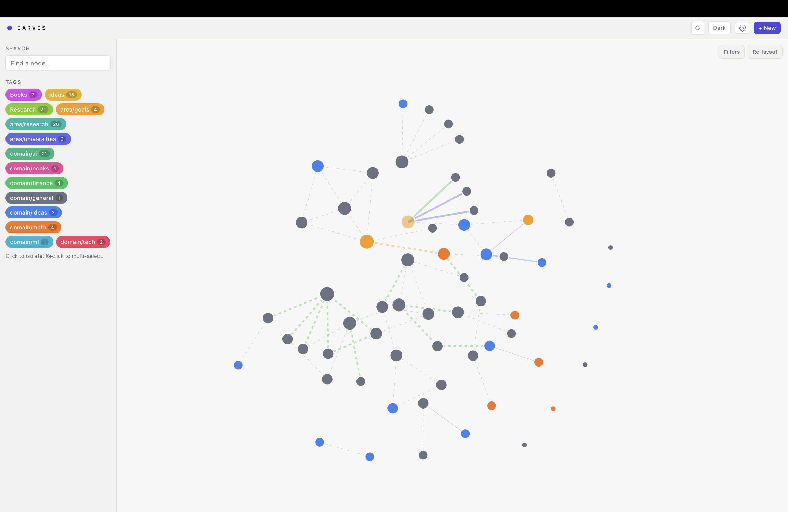
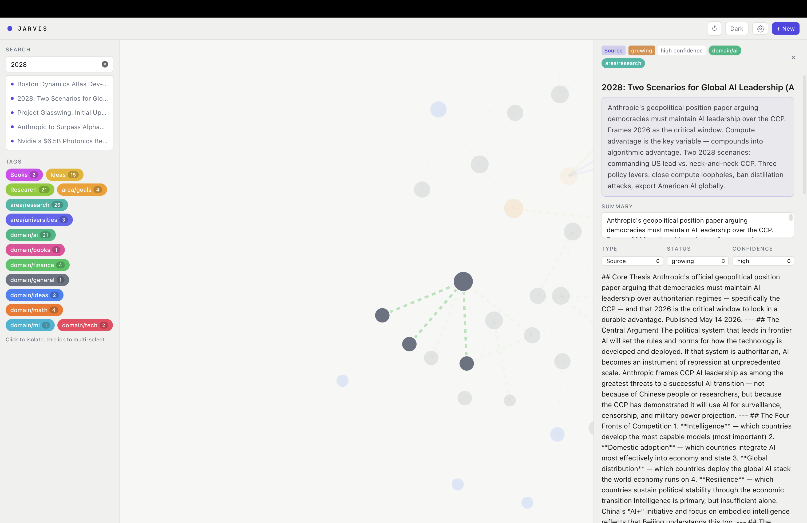
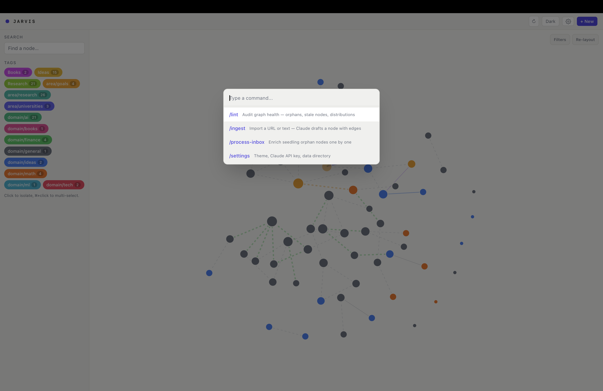

# Jarvis

**Jarvis is a tool that helps with storing and organizing data with a system of connections**



I've decided to create this to help myself with keeping track of interesting articles, news and ideas which I would also be able to link with each other. For me no other tool could do it the same as this.

- 🧠 Every node is interactable and can be opened, moved and deleted. A collection of those nodes moves as a whole.
- 🔗 Different types of connections ensuring each idea is uniquely linked to other nodes
- 🤖 MCP tool for Claude can be used not only to read and create individual nodes but also analyze your graph as a whole
- 🔒 Local-first. No accounts, no cloud, no telemetry.

---

## Install

**Requires an Apple Silicon Mac (M1 or later).**

1. Download the latest `.dmg` → **[Releases](https://github.com/CartHadash/jarvis/releases/latest)**
2. Open the `.dmg` and drag **Jarvis** into your Applications folder.
3. **First launch only:** right-click Jarvis → **Open** → **Open**.

> macOS will say the app is from an unidentified developer. That's expected — the app isn't code-signed. Right-click → Open is how you get past it the first time; after that it opens normally.

Your notes live at `~/Library/Application Support/app.jarvis/jarvis.db` and never leave your machine.

---

## Screenshots


### The Node Editor


Each node is viewed separately with a nice zoom in effect

### The Command Palette


By pressing ⌘K a command palette could be opened with a choice of unique commands

---

## Using it with Claude

By implementing it with Claude's MCP tool I wanted to give it a possibility to be a part of context Claude has about my ideas and interests that could help in brainstorming and executing

Add this to Claude Desktop's config at
`~/Library/Application Support/Claude/claude_desktop_config.json`:

```json
{
  "mcpServers": {
    "jarvis": {
      "command": "node",
      "args": ["/absolute/path/to/jarvis/mcp-server/index.js"]
    }
  }
}
```

Restart Claude Desktop. A 🛠 icon by the chat input means it worked.

Twelve tools are exposed — reading the index, full-text search, creating notes, linking them, and daily session logs.

---

## Build from source

Requires Node 20+, Rust 1.77+, and Xcode command line tools.

```sh
git clone https://github.com/CartHadash/jarvis.git
cd jarvis
npm install
cd mcp-server && npm install && cd ..

npm run tauri:dev      # run in development
npm run tauri:build    # build a .dmg into src-tauri/target/release/bundle/
```

---

## Built with

| Layer | Tech |
| --- | --- |
| Interface | React 18 · TypeScript · D3 · Tailwind · TipTap |
| Shell | Tauri v2 (Rust) |
| Storage | SQLite (WAL) with FTS5 full-text search |
| AI bridge | Node.js MCP server |

---

## License

This project is licensed under the [MIT License](LICENSE) — see the [LICENSE](LICENSE) file for details.

Copyright (c) 2026 CartHadash
